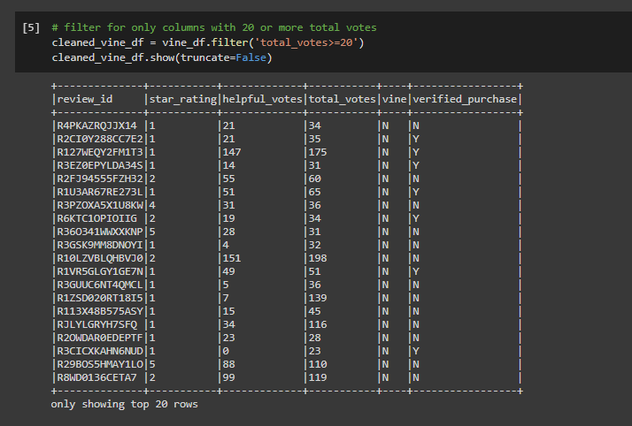

# Amazon_Vine_Analysis

# Overview & Purpose

Since your work with Jennifer on the SellBy project was so successful, you’ve been tasked with another, larger project: analyzing Amazon reviews written by members of the paid Amazon Vine program. The Amazon Vine program is a service that allows manufacturers and publishers to receive reviews for their products. Companies like SellBy pay a small fee to Amazon and provide products to Amazon Vine members, who are then required to publish a review.

In this project, you’ll have access to approximately 50 datasets. Each one contains reviews of a specific product, from clothing apparel to wireless products. You’ll need to pick one of these datasets and use PySpark to perform the ETL process to extract the dataset, transform the data, connect to an AWS RDS instance, and load the transformed data into pgAdmin. Next, you’ll use PySpark, Pandas, or SQL to determine if there is any bias toward favorable reviews from Vine members in your dataset. Then, you’ll write a summary of the analysis for Jennifer to submit to the SellBy stakeholders.

What You're Creating
This new assignment consists of two technical analysis deliverables and a written report. You will submit the following:

Deliverable 1: Perform ETL on Amazon Product Reviews
Deliverable 2: Determine Bias of Vine Reviews
Deliverable 3: A Written Report on the Analysis (README.md)

Files
Use the following links to download the Challenge starter codes.

- Download the SQL table schema (Links to an external site.).

- Download the Amazon ETL starter code (Links to an external site.).

# Results

 ## Deliverable 1 by completing all requirements below:

The Amazon_Reviews_ETL.ipynb file does the following:
An Amazon Review dataset is extracted as a DataFrame (10 pt)
The extracted dataset is transformed into four DataFrames with the correct columns (20 pt)
All four DataFrames are loaded into their respective tables in pgAdmin (10 pt)

Deliverable 1: Perform ETL on Amazon Product Reviews
From the following Amazon Review datasets (Links to an external site.), pick a dataset that you would like to analyze. All the datasets have the same schemata, as shown in this image:

## The customers_table DataFrame
The customers_table DataFrame To create the customers_table, use the code in the Amazon_Reviews_ETL_starter_code.ipynb file and follow the steps below to aggregate the reviews by customer_id. Use the groupby() function on the customer_id column of the DataFrame you created in Step 6.
Count all the customer ids using the agg() function by chaining it to the groupby() function. After you use this function, a new column will be created, count(customer_id).
Rename the count(customer_id) column using the withColumnRenamed() function so it matches the schema for the customers_table in pgAdmin.

The final customers_table DataFrame should look like this:

## The products_table DataFrame
To create the products_table, use the select() function to select the product_id and product_title, then drop duplicates with the drop_duplicates() function to retrieve only unique product_ids. Refer to the code snippet provided in the Amazon_Reviews_ETL_starter_code.ipynb file for assistance.

The final products_table DataFrame should look like this:

## The review_id_table DataFrame
To create the review_id_table, use the select() function to select the columns that are in the review_id_table in pgAdmin, and convert the review_date column to a date using the code snippet provided in the Amazon_Reviews_ETL_starter_code.ipynb file.

The final review_id_table DataFrame should look like this:

## The vine_table DataFrame
To create the vine_table, use the select() function to select only the columns that are in the vine_table in pgAdmin.

The final vine_table DataFrame should look like this:

## Deliverable 2: Determine Bias of Vine Reviews
Deliverable 2 Instructions

Using your knowledge of PySpark, Pandas, or SQL, you’ll determine if there is any bias towards reviews that were written as part of the Vine program. For this analysis, you'll determine if having a paid Vine review makes a difference in the percentage of 5-star reviews.

There is a DataFrame or table for the vine_table data using one of three methods above 

The data is filtered to create a DataFrame or table where there are 20 or more total votes 

The data is filtered to create a DataFrame or table where the percentage of helpful_votes is equal to or greater than 50% 

The data is filtered to create a DataFrame or table where there is a Vine review

The data is filtered to create a DataFrame or table where there isn’t a Vine review

The total number of reviews, the number of 5-star reviews, and the percentage 5-star reviews are calculated for all Vine and non-Vine reviews.

# Summary 
In your summary, state if there is any positivity bias for reviews in the Vine program. Use the results of your analysis to support your statement. Then, provide one additional analysis that you could do with the dataset to support your statement.

In this module I was able to learn:

Define big data and describe the challenges associated with it.
Define Hadoop and name the main elements of its ecosystem.
Explain how MapReduce processes data.
Define Spark and explain how it processes data.
Describe how NLP collects and analyzes text data.
Explain how to use AWS Simple Storage Service (S3) and relational databases for basic cloud storage.
Complete an analysis of an Amazon customer review.

